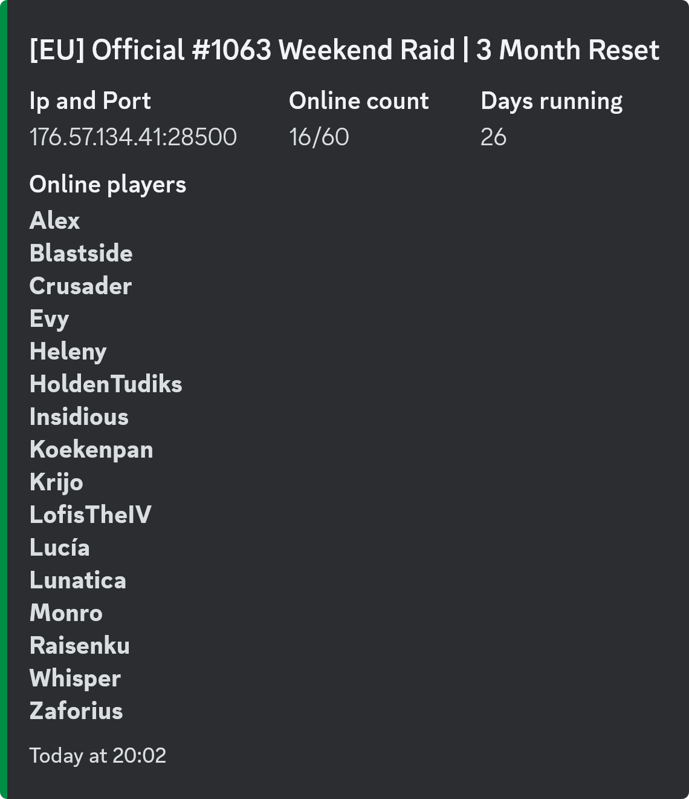
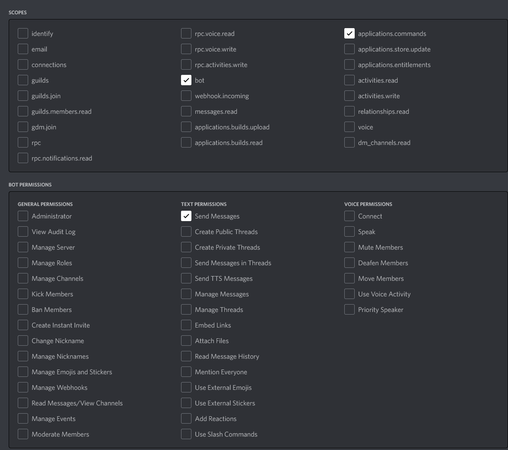

[](https://github.com/DarkAtra/v-rising-discord-bot/actions/workflows/build.yml)

# V Rising Discord Bot

This bot allows you to display some information about your v rising server on discord.



## Support

If you have questions or need support, feel free to join [this discord server](https://discord.gg/KcMcYKa6Nt).

## Discord Commands

Please note that all commands are [guild](https://discord.com/developers/docs/resources/guild) specific.

### `/list-servers`

Lists all server status monitors.

### `/add-server`

Adds a server to the status monitor.

| Parameter                    | Description                                                                                                                                                                                      | Required |
|------------------------------|--------------------------------------------------------------------------------------------------------------------------------------------------------------------------------------------------|----------|
| `server-hostname`            | The hostname of the server to add a status monitor for.                                                                                                                                          | `true`   |
| `server-query-port`          | The query port of the server to add a status monitor for.                                                                                                                                        | `true`   |
| `server-api-port`            | The api port of the server. Use `-1` to set the value to `null`. This is required to integrate with [v-rising-discord-bot-companion](https://github.com/DarkAtra/v-rising-discord-bot-companion) | `false`  |
| `display-server-description` | Whether or not to display the v rising server description on discord. Defaults to not displaying the server description.                                                                         | `false`  |

### `/update-server`

Updates the given server status monitor. Only the parameters that were specified when the command was executed are updated. All other parameters remain
untouched.

| Parameter                    | Description                                                                                                                                                                                      | Required |
|------------------------------|--------------------------------------------------------------------------------------------------------------------------------------------------------------------------------------------------|----------|
| `server-status-monitor-id`   | The id of the server status monitor.                                                                                                                                                             | `true`   |
| `server-hostname`            | The hostname of the server to add a status monitor for.                                                                                                                                          | `false`  |
| `server-query-port`          | The query port of the server to add a status monitor for.                                                                                                                                        | `false`  |
| `server-api-port`            | The api port of the server. Use `-1` to set the value to `null`. This is required to integrate with [v-rising-discord-bot-companion](https://github.com/DarkAtra/v-rising-discord-bot-companion) | `false`  |
| `status`                     | The status of the server status monitor. Either ACTIVE or INACTIVE.                                                                                                                              | `false`  |
| `display-server-description` | Whether or not to display the v rising server description on discord.                                                                                                                            | `false`  |

### `/remove-server`

Removes a server from the status monitor.

| Parameter                  | Description                          | Required |
|----------------------------|--------------------------------------|----------|
| `server-status-monitor-id` | The id of the server status monitor. | `true`   |

### `/get-server-details`

Gets all the configuration details for the specified server.

| Parameter                  | Description                          | Required |
|----------------------------|--------------------------------------|----------|
| `server-status-monitor-id` | The id of the server status monitor. | `true`   |

## Configuration Properties

| Property                       | Type     | Description                                                                                                                      | Default value          |
|--------------------------------|----------|----------------------------------------------------------------------------------------------------------------------------------|------------------------|
| `bot.discord-bot-token`        | String   | The token for the discord bot. You can find this in the [discord developer portal](https://discord.com/developers/applications). | `null`                 |
| `bot.database-path`            | Path     | The path to the database file. Should be overwritten when running inside a docker container.                                     | `./bot.db`             |
| `bot.database-username`        | String   | The username for the database.                                                                                                   | `v-rising-discord-bot` |
| `bot.database-password`        | String   | The password for the database.                                                                                                   | `null`                 |
| `bot.update-delay`             | Duration | The delay between status monitor updates. At least 30 seconds.                                                                   | `1m`                   |
| `bot.max-failed-attempts`      | Int      | The maximum number of attempts to be made until a server is disabled. Use `0` if you don't want to use this feature.             | `0`                    |
| `bot.max-recent-errors`        | Int      | The maximum number of errors to keep for debugging via `/get-server-details`. Use `0` if you don't want to use this feature.     | `5`                    |
| `bot.max-characters-per-error` | Int      | The maximum number of errors to keep for debugging via `/get-server-details`. Use `0` if you don't want to use this feature.     | `200`                  |

## [v-rising-discord-bot-companion](https://github.com/DarkAtra/v-rising-discord-bot-companion) Integration

The v-rising-discord-bot is able to fetch additional data about players, such as the gear level, if
the [v-rising-discord-bot-companion](https://github.com/DarkAtra/v-rising-discord-bot-companion) is installed on the v rising server and the api port of that
server is accessible from where the bot runs. I highly recommend **not** exposing the api port to the internet.

## How to run it yourself using docker-compose

Find the latest docker image [here](https://github.com/DarkAtra/v-rising-discord-bot/pkgs/container/v-rising-discord-bot). If you prefer to use the JVM based
version of this bot, remove the `-native` suffix from the `image` name in the example below.

```yaml
services:
  v-rising-discord-bot:
    image: ghcr.io/darkatra/v-rising-discord-bot:2.1.5-native
    command: -Dagql.nativeTransport=false
    mem_reservation: 128M
    mem_limit: 256M
    volumes:
      - /opt/v-rising-discord-bot:/data/v-rising-discord-bot
    environment:
      - BOT_DISCORD_BOT_TOKEN=<your-discord-bot-token>
      - BOT_DATABASE_PATH=/data/v-rising-discord-bot/bot.db
      - BOT_DATABASE_PASSWORD=<the-database-password>
    restart: unless-stopped
```

Please note that the container uses user `1000:1000`. Make sure that this user has read and write permissions on the volume, in this
case `/opt/v-rising-discord-bot`.

## How to run it yourself without docker

1. Find the latest jar [here](https://github.com/DarkAtra/v-rising-discord-bot/releases) or build the application yourself using `mvn clean verify`
2. Copy the jar file to any directory of you choice and create a file `application.yml` with the following content in the same directory:
   ```yaml
   bot:
     discord-bot-token: <your-discord-bot-token>
     database-password: <the-database-password>
   ```
3. Run the application using `java -jar v-rising-discord-bot-<version>.jar`
4. Profit

If you run the application in a Linux environment, make sure that you use a separate user. Also, ensure that you're using at least Java 17.
This user only needs read and write permissions for the `bot.db` database file and read permissions for the `application.yml`, both of which are located in the
applications working directory by default.

You can change the location of the database file by modifying the `application.yml` slightly:

```yaml
bot:
  discord-bot-token: <your-discord-bot-token>
  database-password: <the-database-password>
  database-path: /data/bot.db
```

## Native Docker Image (Beta)

The v-rising-discord-bot is also available as a native executable built with GraalVM Native Image. The native executable should behave exactly the same as
the JVM version but requires less memory and is overall faster. It is also possible to use the same database with bot the native executable and the jar version.
Please [file a new issue](https://github.com/DarkAtra/v-rising-discord-bot/issues/new/choose) if you notice any issues.

Find the latest native docker image [here](https://github.com/DarkAtra/v-rising-discord-bot/pkgs/container/v-rising-discord-bot).

## Required Permissions


