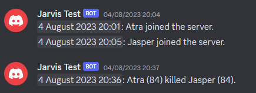

## [v-rising-discord-bot-companion](https://github.com/DarkAtra/v-rising-discord-bot-companion) Integration

The bot is able to fetch additional data about players, such as the gear level, if
the [v-rising-discord-bot-companion](https://github.com/DarkAtra/v-rising-discord-bot-companion) is installed on the v rising server and the api port of that
server is accessible from where the bot is running.

> [!WARNING]
> **I highly recommend not exposing the api port to the internet in an unprotected manner.**

### Enabling the v-rising-discord-bot-companion integration

1. Update your v-rising-discord-bot to [the latest version](https://github.com/DarkAtra/v-rising-discord-bot/releases).
2. [Install the v-rising-discord-bot-companion](https://github.com/DarkAtra/v-rising-discord-bot-companion#installing-this-bepinex-plugin-on-your-v-rising-server)
   on your V Rising Server.
3. Update the configuration of your v rising server using the `/update-server` discord command. You should be able to set both the `server-api-hostname` and
   the `server-api-port`. **It is not recommended to expose the api port to the internet in an unprotected manner.** Ensure that the api port is accessible only
   by the bot.
4. You should now see the additional data the next time the discord embed is updated (once every minute by default).
