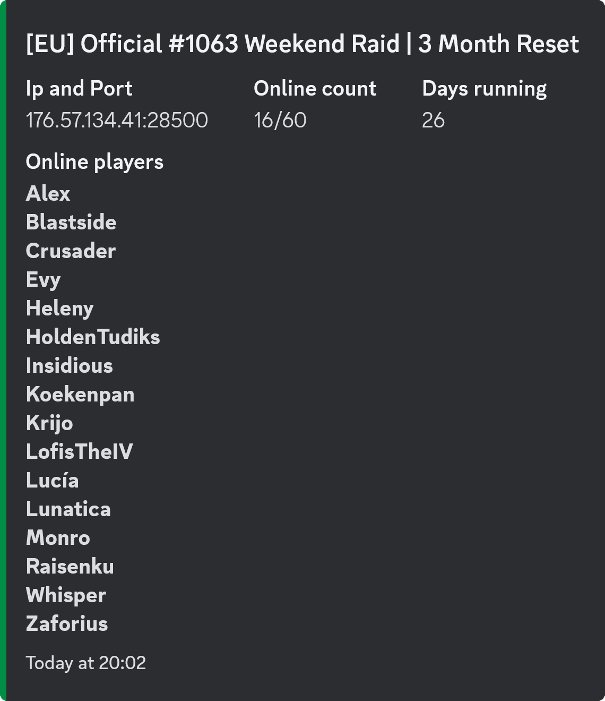

# V Rising Discord Bot

Welcome to the documentation for the [v-rising-discord-bot](https://github.com/DarkAtra/v-rising-discord-bot).
The bot allows you to display some information about your v rising server on discord.

This is what the status embed looks like:

The bot consists of two parts, the [v-rising-discord-bot](https://github.com/DarkAtra/v-rising-discord-bot)
(`bot` from here on) and the [v-rising-discord-bot-companion](https://github.com/DarkAtra/v-rising-discord-bot-companion) (`bot-companion` from here on), a
server-side mod, which is required if you want to use any of the following features:

* displaying the current gear level of all players in the status embed
* posting a message in a discord channel when a player joins or leaves the V Rising server
* displaying a PVP kill feed on discord

Here's an example of what that would look like:

## Using the bot

Now that you know the features of the bot, let's see how you can use it.
The simplest is to use the instance of the bot that I host for you.
Refer to [this step-by-step guide](bot-as-a-service.md#setup-guide) if you want to get started.

If you are experienced in running and maintaining software, there's also the option of self-hosting the bot.
This allows you to tweak all [configuration-properties](configuration-properties.md) to your liking. Refer to [this page](self-hosting.md) for details.

## Support

If you have questions or need support, feel free to join [this discord server](https://discord.gg/KcMcYKa6Nt).
