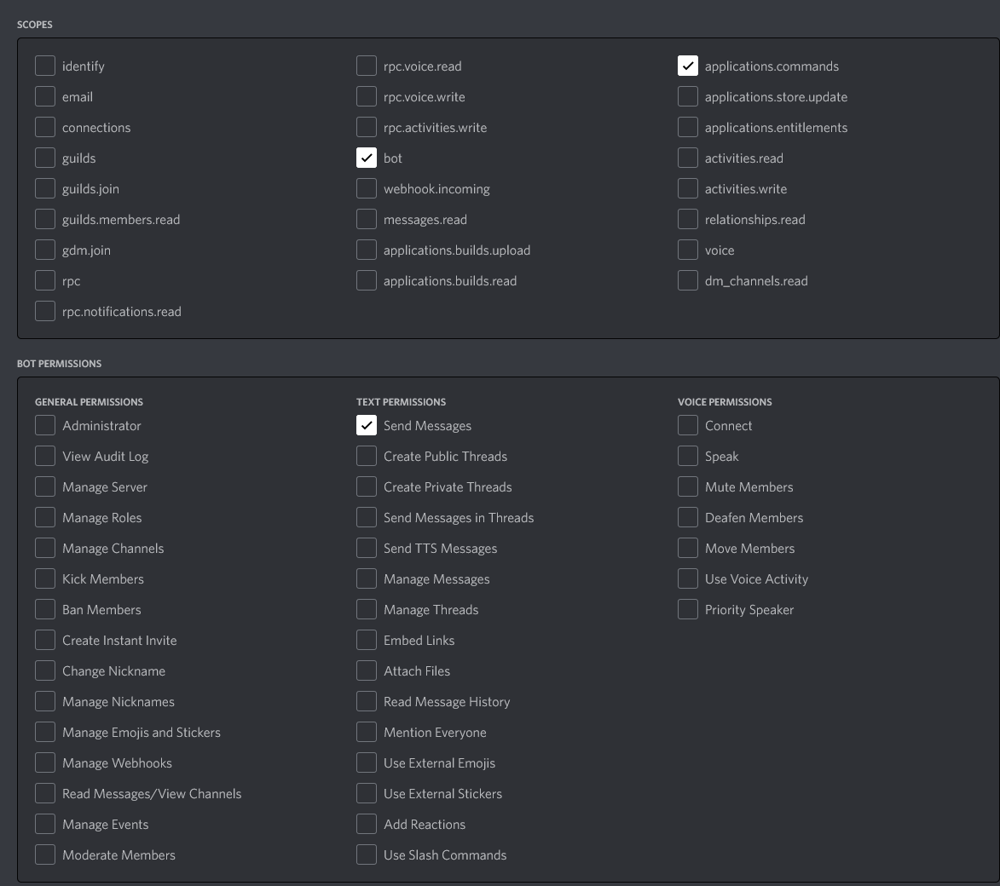

# Self-hosting the bot

> [!WARNING]
> I only recommend self-hosting the bot if you are experienced in running and maintaining software.

You have two options for running the bot, using docker and running on bare metal. I generally recommend running it as a docker container as it reduces the
maintenance effort and simplifies the configuration on your end.

## Hosting the bot using docker-compose

Find the latest docker image [here](https://github.com/DarkAtra/v-rising-discord-bot/pkgs/container/v-rising-discord-bot).
You can also build it from scratch by cloning the repository and then running `mvn clean package spring-boot:build-image`.

> [!NOTE]
> There are two docker images available. The docker image with the `-native` suffix is a highly optimized version of the bot that runs with a lower
> memory footprint as it does not require a JVM. The image was generated using GraalVM and currently only supports the `x64` architecture.
> I generally recommend you to use that version if you can.

[//]: # (@formatter:off)
```yaml
services:
  v-rising-discord-bot:
    image: ghcr.io/darkatra/v-rising-discord-bot:2.8.0-native
    command: -Dagql.nativeTransport=false
    mem_reservation: 128M
    mem_limit: 256M
    volumes:
      - /opt/v-rising-discord-bot:/data/v-rising-discord-bot
    environment:
      - BOT_DISCORD_BOT_TOKEN=<your-discord-bot-token>
      - BOT_DATABASE_PATH=/data/v-rising-discord-bot/bot.db
      - BOT_DATABASE_PASSWORD=<the-database-password>
    restart: unless-stopped
```
[//]: # (@formatter:on)

> [!NOTE]
> The container uses user `1000:1000`. Make sure that this user has read and write permissions on the volume, in this
> case `/opt/v-rising-discord-bot`. Also, if you're on windows, please replace `/opt/v-rising-discord-bot` in the example above with any valid window path,
> e.g. `/C/Users/<username>/Desktop/v-rising-discord-bot`.

## Hosting the bot without docker

1. Install a Java Virtual Machine. You'll need at least Java 17.
2. Find the latest jar [here](https://github.com/DarkAtra/v-rising-discord-bot/releases) or build the application yourself using `mvn clean verify`
3. Copy the jar file to any directory of you choice and create a file `application.yml` with the following content in the same directory:
   [//]: # (@formatter:off)
   ```yaml
   bot:
     discord-bot-token: <your-discord-bot-token>
     database-password: <the-database-password>
   ```
   [//]: # (@formatter:on)
4. Run the application using `java -jar v-rising-discord-bot-<version>.jar`

If you run the application in a Linux environment, make sure that you use a separate user.
This user only needs read and write permissions for the `bot.db` database file and read permissions for the `application.yml`, both of which are located in the
applications working directory by default.

You can change the location of the database file by modifying the `application.yml` slightly:

[//]: # (@formatter:off)
```yaml
bot:
  discord-bot-token: <your-discord-bot-token>
  database-password: <the-database-password>
  database-path: /data/bot.db
```
[//]: # (@formatter:on)

## Discord Commands

Refer to [the commands documentation](./commands.md) for a list of all available discord commands.

## Required Discord Permissions

There are the permissions that your `discord-bot-token` must have:



## Support

If you have questions or need support, feel free to join [this discord server](https://discord.gg/KcMcYKa6Nt).
